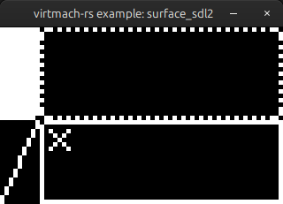

# Examples

```
cargo run --example compile --features compile

Program "compiled" (39b):

        0000 | 02       | loa r0
        0001 | 00       | reg r0
        0002 | F6 01 00 | add #1
        0005 | F3 00 00 | sto #0
...
```

Compiles file `programs/count.txt` and prints out the disassembled binary.

```
cargo run --example run --features compile

--------------------------------
compile|   000a|STA@FLG|Run ...|
STCK@RG|  21  0|CYCCNT@|      4|
--------------------------------
REGS@@@|      1|      0|      0|
      0|      0|      0|      0|
      0|      0|      0|      0|
...
```

Compiles file `programs/count.txt` and continuously runs it at 250ms per instruction.

```
cargo run --example surface_term --features compile

╔════════════════════════════════════════════════════════════════╗ --------------------------------
║                                                                ║ compile|   0036|STA@FLG|Hlt ZCS|
║                                                                ║ STCK@RG|  22  1|CYCCNT@|  43390|
║                                                                ║ --------------------------------
║                                                                ║ REGS@@@|    -14|      7|      1|
║                                                                ║      -6|      1|      0|     12|
║    ▀                                                           ║      64|     40|     32|     20|
║                                                                ║       0|      0|      0|      0|
║                                                ▄▄              ║ --------------------------------
║                                                ▀▀              ║ MEMORY@|     14|     -2|    -23|
...
```

Compiles file `programs/starfield.txt` and continuously runs it at 30 frames-per-second.

Uses the **surface** interrupt defined in `int_surface_term.rs` to draw to a bitplane framebuffer, which is then printed to the terminal.

```
cargo run --example surface_sdl2 --features compile
```



Compiles file `programs/primitives.txt` and continuously runs it at 30 frames-per-second.

Uses the **surface** interrupt defined in `int_surface_sdl2.rs` to draw to a window.

# Programs

Located in the `programs` directory.

|Program|Function|Required interrupt(s)|
|--|--|--|
|`count.txt`|Counts up register 0 and performs some basic arithmetics and store operations.|**base**|
|`starfield.txt`|Displays smaller blinking dots and larger dots floating outwards.|**base**, **surface**
|`primitives.txt`|Draws all of the surface-interrupts primitives along a moving point.|**base**, **surface**
