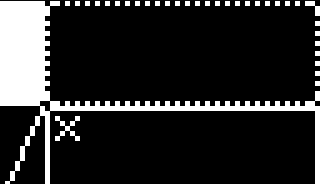

# Examples

```
cargo run --example compile --features compile

Program "compiled" (39b):

        0000 | 02       | loa r0
        0001 | 00       | reg r0
        0002 | F6 01 00 | add #1
        0005 | F3 00 00 | sto #0
...
```

Compiles file `programs/count.txt` and prints out the disassembled binary.

```
cargo run --example run --features compile

--------------------------------
compile|   000a|STA@FLG|Run ...|
STCK@RG|  21  0|CYCCNT@|      4|
--------------------------------
REGS@@@|      1|      0|      0|
      0|      0|      0|      0|
      0|      0|      0|      0|
...
```

Compiles file `programs/count.txt` and continuously runs it at 250ms per instruction.

```
cargo run --example run --features basic -- examples/programs/sum.bas 10
```

Runs another listing or a `.bas` program. The optional second argument sets the milliseconds per instruction. For BASIC programs, the variable values are printed below the dashboard. Only the **proc**, **math** and **random** interrupts are available here.

```
cargo run --example surface_term --features compile

╔════════════════════════════════════════════════════════════════╗ --------------------------------
║                                                                ║ compile|   0036|STA@FLG|Hlt ZCS|
║                                                                ║ STCK@RG|  22  1|CYCCNT@|  43390|
║                                                                ║ --------------------------------
║                                                                ║ REGS@@@|    -14|      7|      1|
║                                                                ║      -6|      1|      0|     12|
║    ▀                                                           ║      64|     40|     32|     20|
║                                                                ║       0|      0|      0|      0|
║                                                ▄▄              ║ --------------------------------
║                                                ▀▀              ║ MEMORY@|     14|     -2|    -23|
...
```

Compiles file `programs/starfield.txt` and continuously runs it at 30 frames-per-second.

Uses the **surface** interrupt defined in `int_surface_term.rs` to draw to a bitplane framebuffer, which is then printed to the terminal.

```
cargo run --example surface_sdl2 --features compile
```



Compiles file `programs/primitives.txt` and continuously runs it at 30 frames-per-second.

Uses the **surface** interrupt defined in `int_surface_sdl2.rs` to draw to a window.

# Running other programs

Every example takes an optional file as its first argument, either a listing or a BASIC program. With the `basic` feature, a file whose first non-empty line is a `REM` statement (optionally numbered, like `10 REM`) is compiled as BASIC, and anything else is compiled as a listing. BASIC programs show their variable values next to the dashboard. `compile` lists where each variable is kept instead.

```
cargo run --example compile --features basic -- examples/programs/gcd.bas
cargo run --example surface_term --features basic -- examples/programs/bounce.bas
cargo run --example surface_sdl2 --features basic -- examples/programs/bounce.bas
```

`run` only provides the **proc**, **math** and **random** interrupts. The other examples also provide **surface**.

# Programs

Located in the `programs` directory.

|Program|Function|Required interrupt(s)|
|--|--|--|
|`count.txt`|Counts up register 0 and performs some basic arithmetics and store operations.|**base**|
|`starfield.txt`|Displays smaller blinking dots and larger dots floating outwards.|**base**, **surface**
|`primitives.txt`|Draws all of the surface-interrupts primitives along a moving point.|**base**, **surface**
|`sum.bas`|FOR/NEXT loops with positive and negative STEP.|**math**|
|`primes.bas`|Counts primes with WHILE, MOD and block IF.|**math**|
|`gcd.bas`|Line numbers, GOSUB/RETURN and GOTO.|**math**|
|`bits.bas`|Hex literals, operators and direct `math.*` calls; spills variables to memory.|**math**|
|`fib.bas`|Arrays with DIM.|**math**|
|`dice.bas`|Calls `random.range`.|**math**, **random**|
|`bounce.bas`|Draws a bouncing box with `surface.*` calls and pauses on HALT once per frame.|**math**, **surface**|
|`pong.bas`|Pong playing against itself, with computer paddles, bounce angles based on where the ball hits the paddle, and scores drawn with `surface.draw_text`. Needs a surface that implements `draw_text` and `get_text_size`.|**math**, **random**, **surface**|
|`control.bas`|`ELSEIF`, `SELECT CASE`, `DO … LOOP`, `EXIT`, `ON … GOTO/GOSUB`, labels and a variable `STEP`.|**math**|
|`subs.bas`|`SUB`, `FUNCTION`, `DEF FN`, `SHARED` and the built-ins `SWAP`, `SGN`, `MIN`, `MAX`, `RND`.|**math**, **random**, **string**|
|`strings.bas`|String literals as `#db` entries, passed by index to `string.get_length` and `surface.draw_text`.|**surface**, **string**|
|`strfuncs.bas`|`STR$`, `MID$`, `LEFT$`, `RIGHT$`, `LEN` and joining with `+` on the **string** interrupt. Results are dynamic strings and need the `alloc` feature.|**surface**, **string**|

# BASIC

With the `basic` feature, `VirtMach::compile` and `VirtMach::compile_owned` also accept BASIC programs, so the SDK's `compiler` compiles them too. BASIC is detected by a first line starting with `REM`. `sdk/src/bin/basic.rs` is a BASIC-only front end that can also write the generated listing (`-l`) and prints where each variable is kept. It compiles into a virtmach listing and then into a binary. It takes the same interrupt list as `compiler`: the order sets the interrupt numbers, and each interrupt's functions are checked against the `.csv` file with the same name. Both tools look for that file next to the compiled source first, then in `./include/`, then in each directory given with `-I` (repeatable), in order. The repository's CSV files are in `include/`. Use the runtime's order:

```
cargo run --manifest-path sdk/Cargo.toml --bin basic -- examples/programs/bounce.bas proc math random surface -l bounce.txt
```

`-l` writes the generated listing, and `-v 2` also prints it. Without a print interrupt, results stay in registers and memory. The compiler prints which register or memory cell each variable uses.

`REQ surface, random` states which interrupts a program needs: compiling fails at that line, naming the available ones, if one of them isn't in the interrupt list. Interrupt functions are called as `interrupt.function(args)`, for example `X = math.and(0x03, 0xf4)`, `surface.clear(0)` or `W, H = surface.get_size()`. Text in double quotes (write `""` for a quote inside it) becomes a `#db` entry. Its value is the entry's index, so `S = "Hello"` stores a number that can be passed to functions like `surface.draw_text`. Identical texts share one entry, and there can be at most 255 different ones. `STR$(n)`, `MID$(s, start[, length])`, `LEFT$(s, n)` and `RIGHT$(s, n)` return the index of a dynamic string built with `string.format` or `string.substr`, and `LEN(s)` calls `string.get_length`. `+` joins strings with `string.concat` when an operand is a string (a literal, a name ending in `$`, or another join), e.g. `S$ = S$ + STR$(I)`. Positions are 1-based. Each call in the source owns one dynamic string that is overwritten every time the call runs, so there can be at most 32 of them. They need the vm's `alloc` feature. `+` and `-` compile to native instructions. `*`, `/`, `MOD`, `^`, `<<`, `>>`, `AND`, `OR`, `XOR` and `NOT` compile to `math` interrupt calls. `SUB` and `FUNCTION` have local variables (unless declared `SHARED`) that start at 0 on every call. They are stored statically, so recursion is a compile error. Strings compare by content through `string.compare`. The language reference is at the top of `src/basic.rs`, and `cargo test --bin basic` (inside `sdk`) runs all example programs in the VM.
